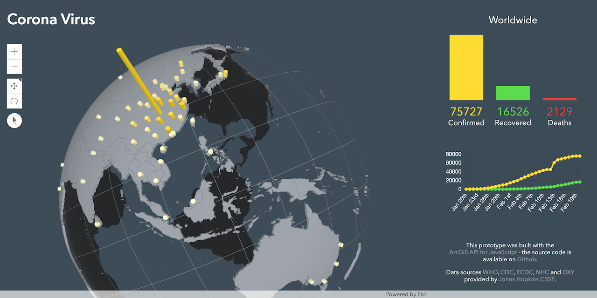

# COVID-19

Dashboard showing the COVID-19 spread on a 3D globe. Prototype was built with the [ArcGIS API for JavaScript](https://developers.arcgis.com/javascript/).

https://arnofiva.github.io/covid19-dashboard/

Data sources from
[WHO](https://www.who.int/emergencies/diseases/novel-coronavirus-2019/situation-reports),
[CDC](https://www.cdc.gov/coronavirus/2019-ncov/index.html),
    [ECDC](https://www.ecdc.europa.eu/en/geographical-distribution-2019-ncov-cases),
    [NHC](http://www.nhc.gov.cn/xcs/yqtb/list_gzbd.shtml) and
    [DXY](https://3g.dxy.cn/newh5/view/pneumonia?scene=2&amp;clicktime=1579582238&amp;enterid=1579582238&amp;from=singlemessage&amp;isappinstalled=0)
    provided by [Johns Hopkins CSSE](https://gisanddata.maps.arcgis.com/apps/opsdashboard/index.html#/bda7594740fd40299423467b48e9ecf6).

